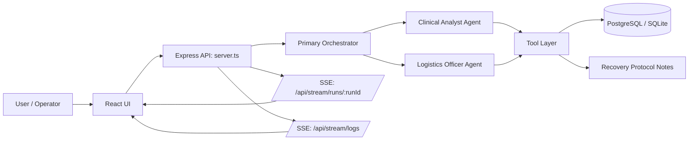
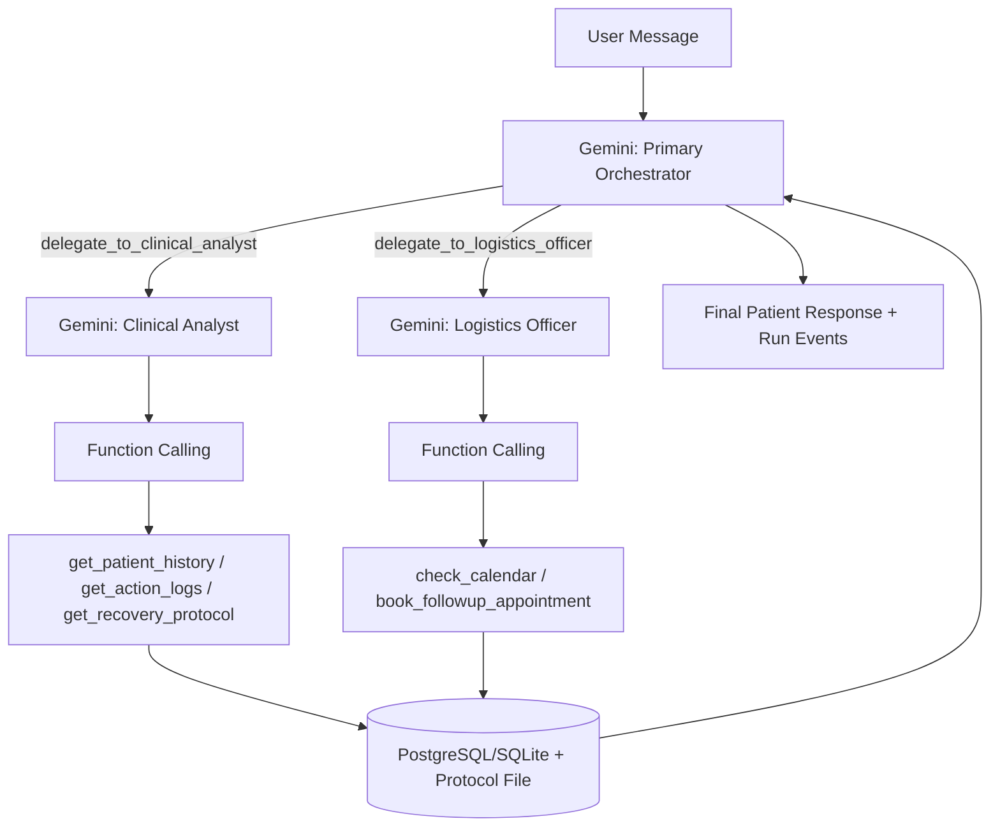
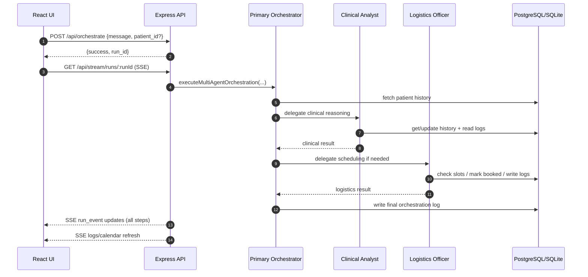
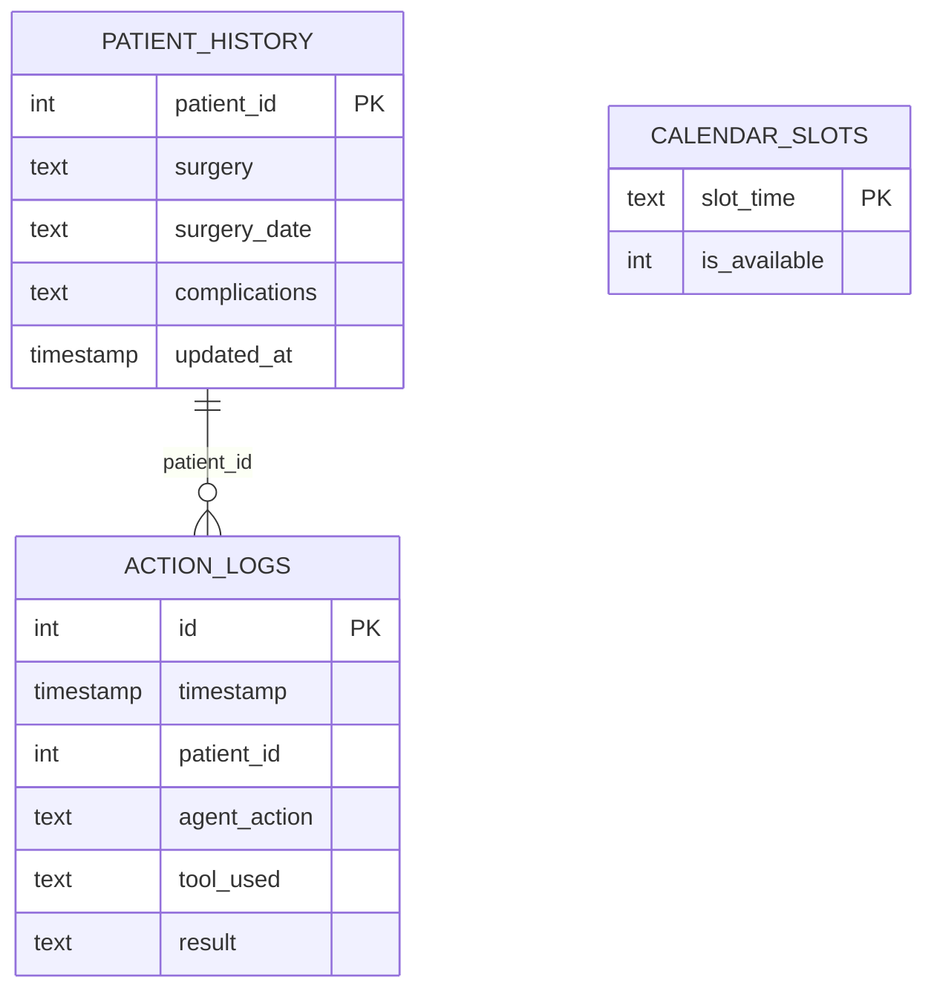
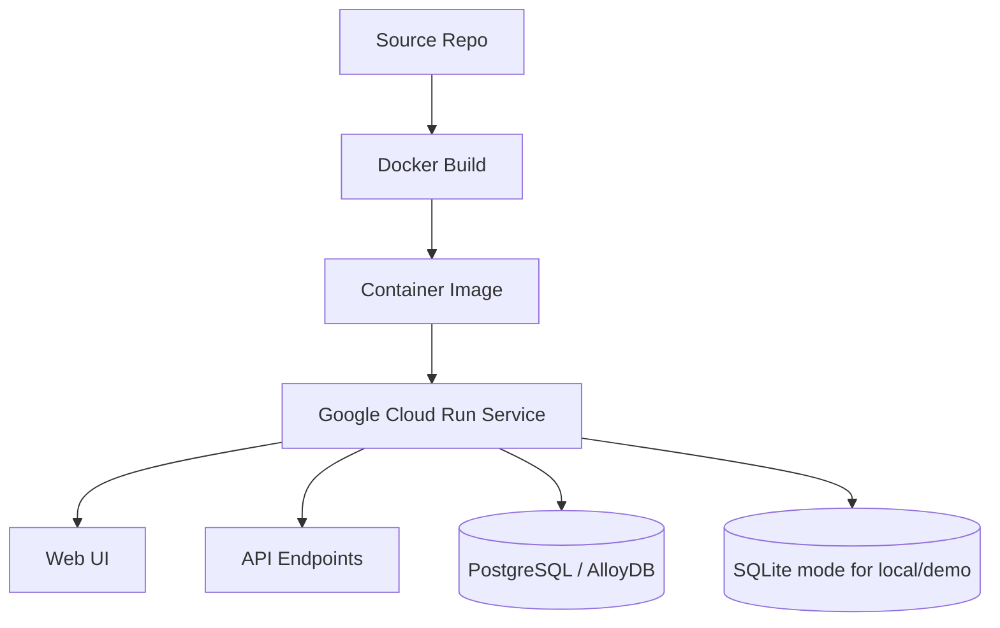

# VitalFlow Architecture Document

## 1. Purpose

VitalFlow is an API-first **Multi-Agent Productivity Assistant** for post-surgery recovery operations.  
It coordinates clinical reasoning and logistics execution, persists structured operational data, and exposes realtime workflow progress to the UI.

This document maps the implementation to core product requirements:

1. Primary agent coordinating sub-agents  
2. Structured database storage/retrieval  
3. Multi-tool integration via MCP-compatible interfaces  
4. Multi-step workflow execution  
5. API-based deployable system

## 2. System Overview

## 2.1 AI Usage Highlights

VitalFlow uses AI as the core execution engine, not just a chat layer:

- **Primary AI agent** performs intent understanding and coordination (`ORCHESTRATOR`).
- **Specialized AI sub-agents** execute domain reasoning:
  - `CLINICAL_ANALYST` for symptom/history/protocol analysis
  - `LOGISTICS_OFFICER` for scheduling decisions and booking actions
- **Gemini function-calling loops** are used to invoke tools deterministically during reasoning.
- **AI decisions are persisted and observable** through audit logs and SSE run events.

## 3. Core Components

### 3.1 API and Runtime

- Entry point: `server.ts`
- Responsibilities:
  - HTTP APIs for orchestration and tools
  - SSE streams for realtime run/log updates
  - DB initialization and query execution
  - CORS, rate limiting, input-size and basic safety headers

### 3.2 Primary + Sub-Agent Orchestration

- Primary orchestration module: `server/agents/orchestrator.ts`
- Agent roles:
  - `ORCHESTRATOR`: route, delegate, and finalize response
  - `CLINICAL_ANALYST`: history/protocol/symptom workflows
  - `LOGISTICS_OFFICER`: calendar availability and booking

### 3.3 Tool Integration (MCP-Compatible)

- Registry: `server/mcpRegistry.ts`
- Endpoints:
  - `GET /api/mcp/tools/list`
  - `POST /api/mcp/tools/call`
- Direct tool APIs:
  - calendar (`/api/tools/calendar`, `/api/tools/calendar/book`)
  - history (`/api/tools/patient-history/*`)
  - logs (`/api/tools/action-logs/*`, `/api/tools/log-task`)
  - protocol (`/api/tools/protocol`)

### 3.4 Data Layer

- SQL module: `db/sql.ts`
- Core tables:
  - `patient_history`
  - `calendar_slots`
  - `action_logs`
- DB mode:
  - PostgreSQL (primary)
  - SQLite (portable fallback)

## 4. End-to-End Orchestration Flow

## 5. Data Model

## 6. API Surface (Key)

- System:
  - `POST /api/orchestrate`
  - `GET /api/stream/runs/:runId`
  - `GET /api/health`
- Observability:
  - `GET /api/logs`
  - `GET /api/stream/logs`
- MCP-compatible bridge:
  - `GET /api/mcp/tools/list`
  - `POST /api/mcp/tools/call`
- OpenAPI + docs:
  - `GET /openapi.json`
  - `GET /docs`

## 7. Deployment Architecture

## 8. Realtime Observability Model

- Run-level telemetry:
  - buffered run events in memory
  - streamed via `/api/stream/runs/:runId`
- Global operational telemetry:
  - recent action logs
  - calendar updates
  - streamed via `/api/stream/logs`
- UI behavior:
  - active agent state updates during run
  - audit trail and calendar refresh without manual reload

## 9. Security and Abuse Controls

- CORS allowlist support (`CORS_ORIGINS`, `CORS_ALLOW_ALL`)
- Rate limits for general and write APIs
- Input validation for IDs and text fields
- JSON body limit (`JSON_LIMIT`)
- Safe response headers (`X-Content-Type-Options`, `X-Frame-Options`, etc.)

## 10. Requirements Traceability

### Goal 1: Primary agent coordinates sub-agents
- Implemented by `executeMultiAgentOrchestration` in `server/agents/orchestrator.ts`
- Delegation tools:
  - `delegate_to_clinical_analyst`
  - `delegate_to_logistics_officer`
- AI execution path uses Gemini model-driven delegation and synthesis.

### Goal 2: Structured DB storage/retrieval
- Implemented using SQL queries in `db/sql.ts`
- Persistent entities: history, slots, action logs

### Goal 3: Multi-tool integration via MCP
- Implemented via MCP-compatible registry and call APIs
- Typed schemas in `server/mcpRegistry.ts`

### Goal 4: Multi-step workflows and execution
- End-to-end run orchestration with conditional delegation and DB updates
- Observable with run-event SSE streams
- AI reasoning + function calling are interleaved across steps until completion.

### Goal 5: API-based deployment
- OpenAPI contract (`openapi.json`) and Swagger UI (`/docs`)
- Dockerized runtime deployable to Cloud Run

## 11. Repository Mapping

- `server.ts`: API host, SSE, middleware, DB bootstrap
- `server/agents/orchestrator.ts`: primary/sub-agent orchestration logic
- `server/mcpRegistry.ts`: MCP-compatible tool schemas
- `db/sql.ts`: centralized SQL statements
- `src/App.tsx`: realtime UI orchestration client
- `openapi.json`: API contract
