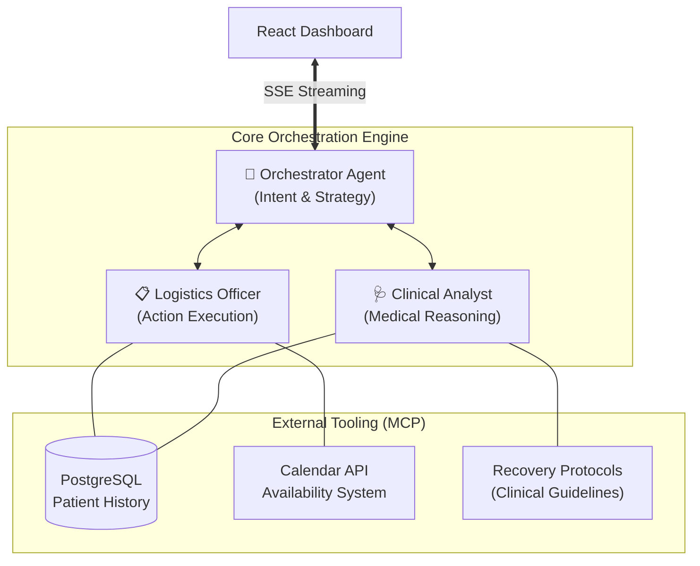

<div align="center">
  
# ⚡️ VitalFlow 

**Autonomous Multi-Agent Care Orchestration** <br>
*Google Gen AI Academy APAC 2026*

[](https://reactjs.org/)
[](https://www.typescriptlang.org/)
[](https://deepmind.google/technologies/gemini/)
[](https://cloud.google.com/)

</div>

---

## 💼 1. The Business Case

### The Problem
Post-surgical patients often leave the hospital with complex recovery protocols but severely limited direct medical supervision. The result is a fragmented communication gap where unmonitored baseline symptoms rapidly escalate into preventable hospital readmissions, skyrocketing healthcare costs, and overwhelming physician bandwidth.

### The VitalFlow Solution
VitalFlow acts as an autonomous, 24/7 clinical coordinator. It bridges the gap between the patient's home and the hospital's electronic health records.
- **Cost Reduction:** Drastically reduces preventable emergency room visits by preemptively identifying protocol deviations.
- **Physician Bandwidth:** Completely automates routine follow-up scheduling and symptom logging, allowing doctors to focus solely on escalated, critical cases.
- **Patient Safety:** Intelligent Emergency Escalation detects life-threatening syntax ("chest pain", "heart attack") and instantly bypasses standard workflows to mandate emergency intervention.

---

## ⚙️ 2. The Multi-Agent Architecture

Instead of utilizing a single monolithic prompt incapable of managing complex logistics, VitalFlow deploys a specialized **Tri-Agent Memory Architecture** leveraging the Model Context Protocol (MCP).



### Agent Roles:
1. **The Orchestrator:** The central nervous system. It parses patient intent, determines safety bounds, and delegates exact tasks to sub-agents.
2. **The Clinical Analyst:** The medical brain. It cross-references active symptoms against historical surgical data and strict post-operative recovery protocols. 
3. **The Logistics Officer:** The administrative arm. If the Analyst determines an appointment is required, this agent autonomously queries availability and secures calendar slots.

---

## 🧬 3. Technical Implementation

VitalFlow is engineered for high-concurrency enterprise healthcare environments, focusing on resilience, auditability, and real-time feedback.

- **Real-Time Execution Pipeline:** Unlike traditional request/response chatbots, VitalFlow utilizes **Server-Sent Events (SSE)**. The UI dashboard receives millisecond-latency *Thought Logs* and *Action Events* as the AI thinks, creating an entirely transparent execution trace.
- **Double-Layer Persistence:** A hybrid state. **AlloyDB / PostgreSQL** powers the high-concurrency production audit trail, while an automatic SQLite edge fallback guarantees zero downtime and un-interrupted logic flow even if the primary database partition fails.
- **Model Context Protocol (MCP):** Every external integration (calendar booking, history upserting, protocol reading) is strictly typed as a modular MCP Tool, guaranteeing LLM hallucination resistance when writing to the database.

---

## 🛠 4. Developer Quick Start

VitalFlow operates a sophisticated hybrid environment, dynamically compiling the Vite SPA and booting the Express API simultaneously from a single entry point.

1. **Install Dependencies**
   ```bash
   npm ci
   ```

2. **Environment Configuration**
   ```bash
   cp .env.example .env
   # Ensure GEMINI_API_KEY is legally provisioned
   # Set USE_VITE_DEV_SERVER=true for frontend HMR
   ```

3. **Launch the Unified Engine**
   ```bash
   npm run dev
   ```

**System Dashboards:**
- *Real-time UI:* [http://localhost:3000](http://localhost:3000)
- *Swagger Interactive Specs:* [http://localhost:3000/docs](http://localhost:3000/docs)
- *System Health Check:* `GET /api/health`

---
<div align="center">
  <p><b>Built with ❤️ to redefine patient care.</b></p>
</div>
